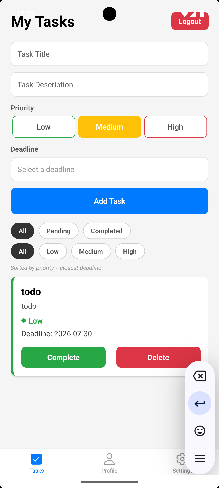
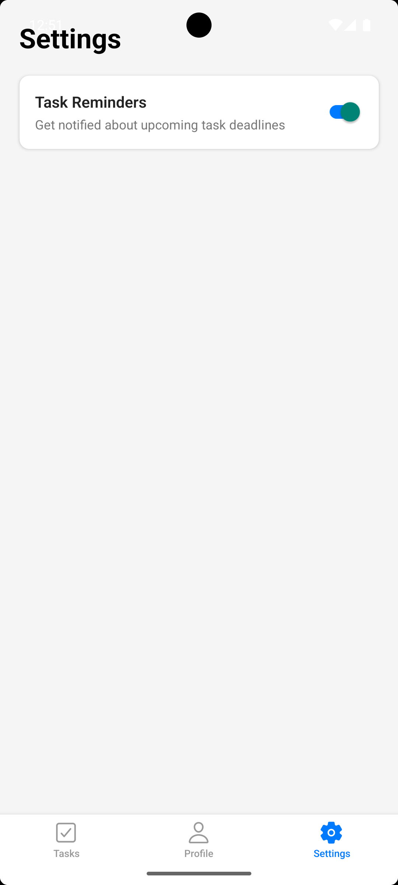
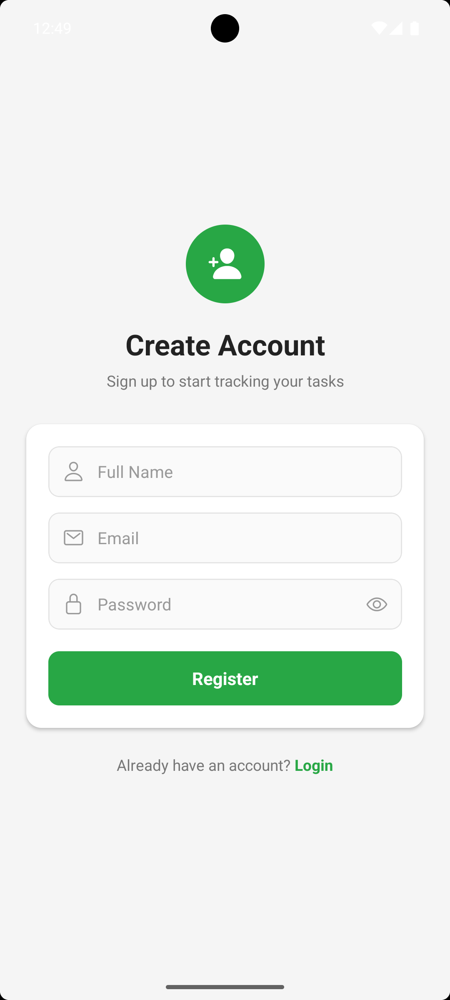
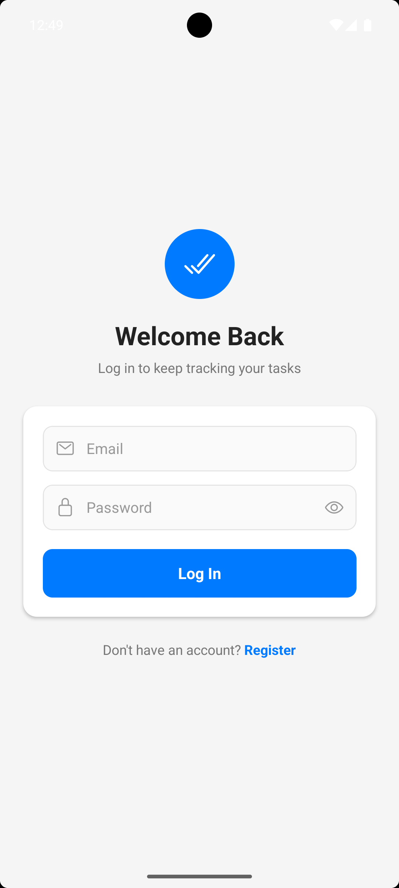
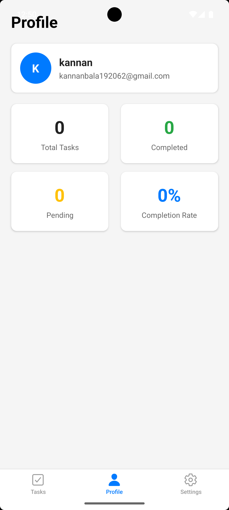
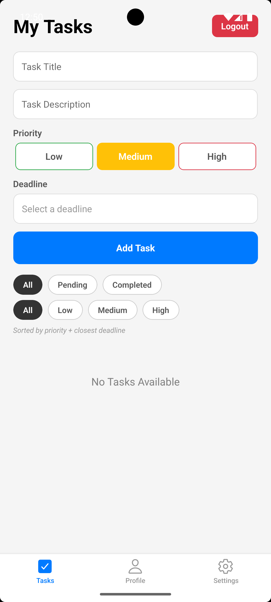

# 📱 React Native Todo — Full Stack App

A modern full-stack Todo application built with **React Native**, **Node.js**, **Express.js**, and **MongoDB**. Register, log in, and manage your daily tasks with priorities, deadlines, and completion tracking — all wrapped in a clean, minimal UI.

<p align="center">
  
  
  
</p>

---

## 🚀 Features

### Authentication
- User registration
- User login
- JWT-based authentication
- Auto login (persisted session)
- Logout

### Task Management
- Create tasks with title & description
- View all tasks
- Update tasks
- Delete tasks
- Mark tasks as completed
- Set task priority (Low / Medium / High)
- Set task deadline
- Filter by status (All / Pending / Completed) and priority
- Auto-sort by priority + closest deadline

### Profile
- View user profile details
- Task statistics: total, completed, pending, completion rate

### Settings
- Toggle task reminder notifications

---

## 🛠 Tech Stack

**Frontend**
- React Native CLI
- TypeScript
- React Navigation
- Axios
- AsyncStorage
- React Native Vector Icons

**Backend**
- Node.js
- Express.js
- TypeScript
- MongoDB Atlas
- Mongoose
- JWT Authentication
- bcryptjs

---

## 📂 Project Structure

```
react-native-todo-fullstack
│
├── backend
│   ├── src
│   │   ├── controllers
│   │   ├── routes
│   │   ├── middleware
│   │   ├── models
│   │   ├── config
│   │   └── utils
│   └── package.json
│
├── mobile
│   ├── src
│   │   ├── screens
│   │   ├── components
│   │   ├── services
│   │   ├── context
│   │   └── navigation
│   └── package.json
│
└── README.md
```

---

## ⚙️ Installation

### Clone the Repository
```bash
git clone https://github.com/KannanBalakrishnan-dev/react-native-todo-fullstack.git
cd react-native-todo-fullstack
```

### Backend Setup
```bash
cd backend
npm install
npm run dev
```

Create a `.env` file inside `backend/`:
```env
PORT=8000
MONGO_URI=YOUR_MONGODB_CONNECTION_STRING
JWT_SECRET=YOUR_SECRET_KEY
```

### Mobile Setup
```bash
cd mobile
npm install
npx react-native run-android
```

---

## 📡 API Endpoints

### Authentication
| Method | Endpoint            | Description          |
|--------|---------------------|-----------------------|
| POST   | `/api/auth/register`| Register a new user   |
| POST   | `/api/auth/login`   | Log in a user          |
| GET    | `/api/auth/me`       | Get current user info |

### Tasks
| Method | Endpoint          | Description        |
|--------|-------------------|----------------------|
| GET    | `/api/tasks`      | Get all tasks        |
| POST   | `/api/tasks`      | Create a new task     |
| PUT    | `/api/tasks/:id`  | Update a task         |
| DELETE | `/api/tasks/:id`  | Delete a task         |

---

## 📸 Screenshots

| Login | Register | Tasks (Empty) |
|:---:|:---:|:---:|
|  |  |  |

| Tasks (List) | Profile | Settings |
|:---:|:---:|:---:|
|  |  |  |

---

## 🎥 Demo Video
Add your demo video link here:
```
https://drive.google.com/...
```

---

## 📦 APK
Download the APK:
```
(https://drive.google.com/drive/folders/1Ob6YbG16eIAUfjnur9YO0Ep7SL_tJg1B?usp=drive_link)
```

---

## 👨‍💻 Author

**Kannan Balakrishnan**

- GitHub: [KannanBalakrishnan-dev](https://github.com/KannanBalakrishnan-dev)
- LinkedIn:(https://www.linkedin.com/in/kannan-balakrishnan-409911282/)
---

## 📄 License

This project is developed for educational and assessment purposes.
